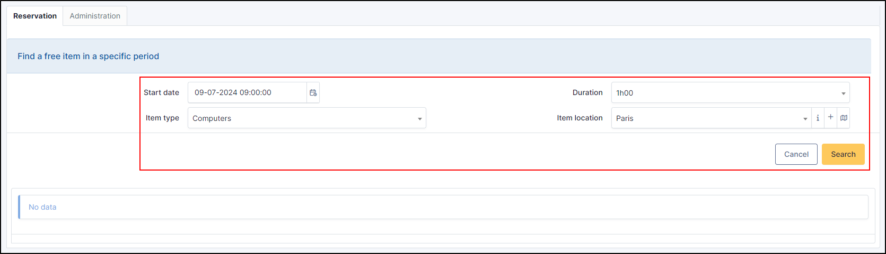

Manage reservations
===================

GLPI includes an equipment reservation tool that allows to select assets in order to reserve them for a time slot. For repetitive reservations, it is possible to declare a reservation as recurrent.

.. note::

   By default, an equipment is not reservable!

   Making an equipment reservable is done from the `Reservation` tab of the equipment's form.

.. image:: images/details-booking.png
   :alt: Characteristics of a reservation
   :align: center
   :scale: 70 %

Add a reservation
-----------------

* To add a reservation, you can either :

  * Go to the object to be reserved (depending on the profile authorizations)
  * Go to **Tools** > **Reservation** (depending on the profile authorizations)

* Click on the desired date to display the reservation box

  * If you have used the reservation tab of the GLPI object, the hardware will already be defined.
  * If you've gone to the **Tools** > **Reservation** > **View all items** tab, you'll need to select the desired item.

* Select **user** if not already preselected
* Select the **start date**
* Select the duration (you can specify an end date if the reservation exceeds 1 day)
* Add a comment if it's necessary

Add a repetition
~~~~~~~~~~~~~~~~

If your booking is to be repeated or spread over several **days/weeks/months**, you can add a repeat to it

Daily repetition
^^^^^^^^^^^^^^^^

* Select **daily** in repetition
* select the **end date** (the reservation will also be added to the last day selected)

Weekly repetition
^^^^^^^^^^^^^^^^^

* Select **weekly** in repetition
* select the **end date** (the reservation will also be added to the last day selected)
* Select the days on which the rehearsal will take place

Monthly repetition
^^^^^^^^^^^^^^^^^^

* Select **monthly** in repetition
* select the **end date** (the reservation will also be added to the last day selected)
In the dropdown list select :

   * Each month, same date
   * Each month, same day of weekly (for example, if your booking is on the Tuesday of the 2nd of the month,
     the repeat will take place on the same day of the following month.)

View a reservation
------------------

A reserved equipment will be displayed in global reservation planning.

.. image:: images/planning-booking.png
   :alt: Global reservation planning
   :align: center
   :scale: 44 %

It is also possible to consult the specific planning of a reservable equipment. A reservation can also be created from this planning.

.. image:: images/planningspe-booking.png
   :alt: Specific reservation planning
   :align: center
   :scale: 44 %

You can see all the reservation by clicking on View calendar for all items (**Tools** > **Reservations**)

Find a free item
----------------

* To simplify your equipment search, you can go to **Tools** > **Reservation** > **Find a free item in a specific period**

* If you don't have result, you can extend your search to all GLPI object types without all locations

* To proceed to booking click on booking calendar and follow the previous steps.

Delete or modify a reservation
------------------------------

You can modify a reservation by clicking on it. If you modify an occurrence, only the selected one is modified.
If you wish to modify the whole series, you will either have to delete it and start again, or modify them one by one.

To delete a reservation, click on it and click delete permanently.
If you wish to delete all occurrences, you can click on delete all and delete permanently.

Disable reservation
-------------------

From the GLPI object, you can deactivate the reservation or remove the reservation option.

1. **Make unavailable** : deactivates the reservation feature, reservations are also deactivated.
   If the object is reservable again, the reservations that were present will be visible again.
2. **Prohibit reservations** : deactivates and deletes all current reservations. The equipment can no longer be reserved.

Administration tab
------------------

This tab display all reservable items. As for main GLPI items, it offers a search engine with mass actions.

* If you click on the item name, you'll be taken back to the equipment sheet
* If you click on the schedule icon, you will be redirected to the equipment schedule.