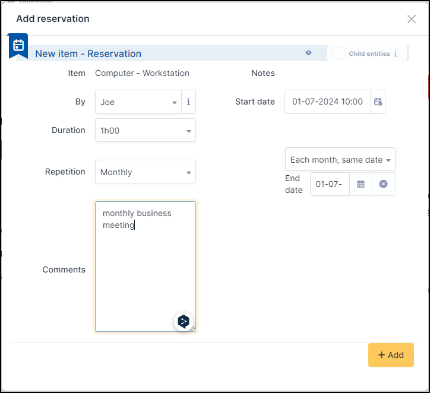

Manage reservations
===================

GLPI includes an equipment reservation tool that allows to select assets in order to reserve them for a time slot. For repetitive reservations, it is possible to declare a reservation as recurrent.

.. note::

   By default, an equipment is not reservable!

   Making an equipment reservable is done from the `Reservation` tab of the equipment's form.

A reserved equipment will be displayed in global reservation planning.

It is also possible to consult the specific planning of a reservable equipment. A reservation can also be created from this planning.

The different tabs
------------------

Reservations
~~~~~~~~~~~~

This main tab of the tool allows to display and select available reservable equipments.

Administration
~~~~~~~~~~~~~~

This tab display all reservable items and not only the available ones. As for main GLPI items, it offers a search engine with mass actions.
