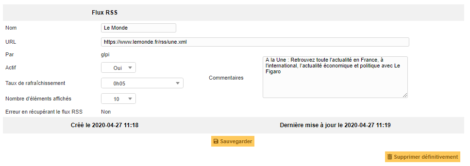

Manage RSS feeds
================

GLPI allows to include RSS feeds in tool home page.

A RSS feed is by default personal and therefore only visible by its creator.

For a RSS feed to become public and visible by other users, targets must be added to it, a target being either an entity, a group, a profile or a user.

.. note::
   A public RSS feed is visible by users associated with a profile if this profile has read permission for public RSS feeds.

The different tabs
------------------

Content
~~~~~~~

This tab allows to consult the number of displayed items; this content is the one displayed on home page.

Targets
~~~~~~~

This tab allows to display and modify the list of targets of the RSS feed.

.. include:: ../tabs/historical.rst

.. include:: ../tabs/all.rst
