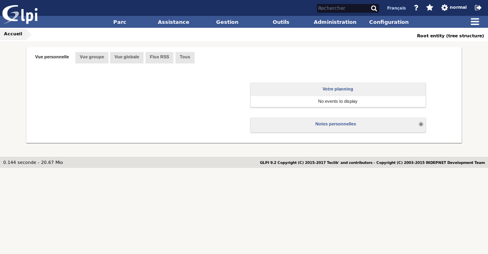
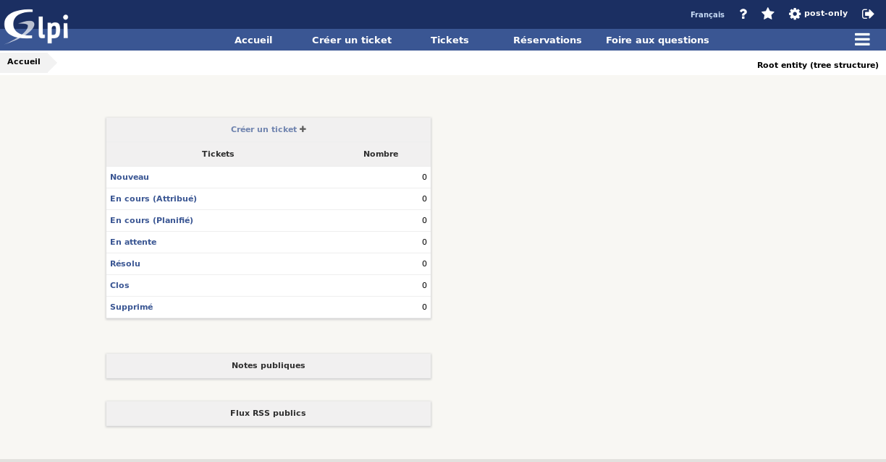

Les interfaces utilisateur
==========================

.. note::

   Le choix de l'interface par défaut ainsi que des différents modules à afficher ou non sont :ref:`paramétrables dans les profils <administration-profils>` ou depuis les :doc:`preférences de l'utilisateur <preferences>`.

.. _interface-standard:

L'interface standard
--------------------

C'est l'interface principale de l'application. L'ensemble des modules est disponible ; il existe toutefois des limites en fonction des paramétrages des profils.

La page d'accueil de l'*interface standard* fournit une vue synthétique pour accéder rapidement aux éléments actifs (tickets, notes, planning, contrats...).

Elle est découpée en 4 vues :

* *La vue personnelle*

   Présente les tickets ouverts, rejetés, à traiter, à approuver (dont l'utilisateur connecté est le demandeur) ou ceux sur lesquels cet utilisateur a une interaction en tant que valideur ou technicien (en attente de validation, en cours, à clôturer, en attente). Cette vue lui propose également les problèmes en cours, son planning et les notes disponibles.
* *La vue groupe*

   Propose les mêmes informations à propos des tickets et des problèmes que la vue personnelle mais en prenant comme référence les groupes auxquels il appartient. Suivant son profil, il aura accès ou non aux tickets pour lesquels ses groupes sont demandeurs.

* *La vue globale*

   Propose des statistiques sur les tickets et les problèmes en fonction de leurs statuts et sur les contrats en fonction de leur date d'expiration. Elle propose également la vue des derniers ajouts d'objets dans GLPI. Suivant la configuration utilisée, les nouveaux tickets peuvent aussi être présentés dans cet onglet.

* *Flux RSS*

   Propose le contenu des flux RSS définis (voir [Gérer les flux RSS](06_Module_Outils/04_Flux_RSS.rst "Les flux RSS se gèrent depuis le menu Outils > Flux RSS")).

.. note::

   Pour les vues Personnelle et Groupe, seuls s'affichent les tableaux ayant des informations.

.. note::

   Deux messages de sécurité peuvent être affichés lors de votre première connexion à l'issue de la procédure d'installation.

   Le premier vous invite à modifier les mots de passe des comptes créés par défaut dans GLPI, le second à supprimer le répertoire ``glpi/install``.

   .. image:: images/security-messages.png
      :alt: Message de sécurité
      :align: center
      :scale: 50%

   Tant que vous n'aurez pas réalisé ces opérations les messages subsisteront.

.. _interface-simplifiee:

L'interface simplifiée
----------------------

C'est l'interface la plus restrictive de l'application. Le nombre de modules disponibles est réduit au minimum.

Elle est destinée aux utilisateurs ayant des habilitations très restreintes sur l'application : helpdesk en libre service.

Dans la configuration par défaut, un utilisateur peut, depuis cette interface, uniquement créer des tickets, suivre le traitement de ses tickets, réaliser des réservations, voir les notes ou les flux RSS publics (ou créer des notes ou flux privés) et consulter la foire aux questions.

La page d'accueil propose le nombre de ses tickets suivant leurs statuts ainsi que les sujets de la FAQ les plus populaires et les plus récents.
