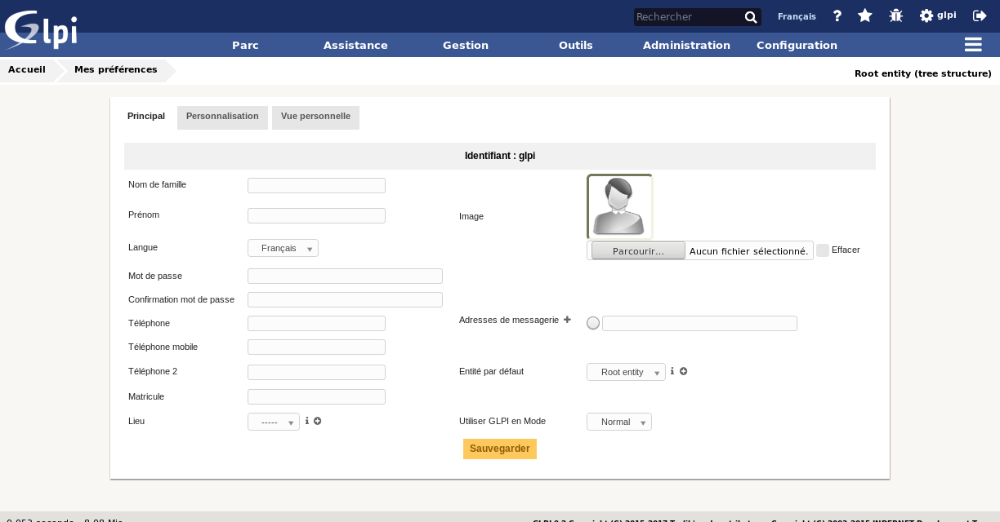
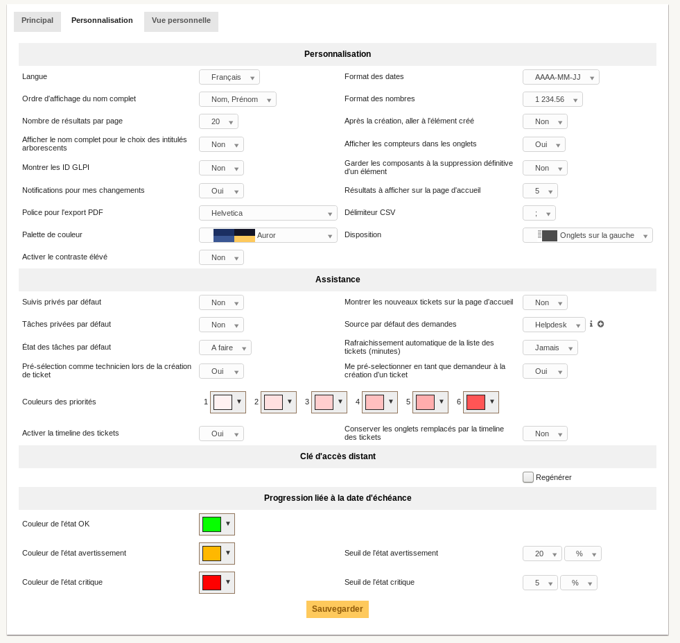

Gérer ses préférences
=====================

Les préférences utilisateur sont accessibles depuis l'onglet *Préférences* de la fiche utilisateur ; en cliquant sur son nom en haut à droite de l'interface, à partir de n'importe quelle page.

Chaque utilisateur authentifié a la possibilité de modifier ses préférences.

Onglet Principal
----------------

L'utilisateur peut ici modifier les informations personnelles usuelles :

* nom de famille,
* prénom,
* adresse de messagerie,
* numéros de téléphone,
* lieu,
* langue,
* ...

.. note::

   Certains champs ne sont pas modifiables s'ils proviennent d'un annuaire LDAP.

Il peut ajouter des adresses de messagerie et sélectionner l'adresse par défaut, qui sera utilisée pour  l'envoi des notifications.

Il peut aussi spécifier certains comportements par défaut de l'application, comme :ref:`le profil <administration-profils>` et :ref:`l'entité <administration-entites>` sélectionnés. Il peut également désactiver les notifications pour les actions qu'il réalise.

En fonction des profils, l'utilisateur expérimenté peut aussi choisir de sortir du mode d'utilisation normal de l'application. Dans le mode debug, GLPI affiche les erreurs, toutes les valeurs des variables, les requêtes SQL... Il est utile d'activer ce mode en cas de dysfonctionnement de GLPI. Un maximum d'informations peuvent ainsi être communiquées aux développeurs. Ce mode permet également d'avoir des informations supplémentaires sur différents objets dans un onglet spécifique (notifications...).

Onglet Personnalisation
-----------------------

Cet onglet permet de modifier les préférences générales d'affichage appliquées à un utilisateur donné. Ces paramètres sont prioritaires sur ceux définis dans la :ref:`configuration générale <administration-affichage>`.

.. note::

   La valeur du *Nombre de résultats par page* indiquée ici ne peut dépasser la valeur maximale définie dans les options générales d'affichage.

Il est à noter que la section *Clé d'accès distant* permet de régénérer la clé de sécurité utilisée pour accéder aux flux privés offerts par GLPI. Actuellement les flux ICAL et WEBCAL du planning sont protégés par cette clé de sécurité qui est intégrée à l'url.

Onglet Vue personnelle
----------------------

Recense les affichages personnalisés définis dans les objets par l'utilisateur. Il permet notamment de supprimer les vues personnelles définies pour revenir aux vues globales.
