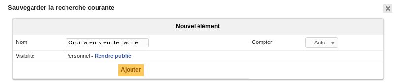
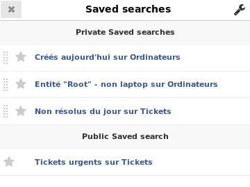
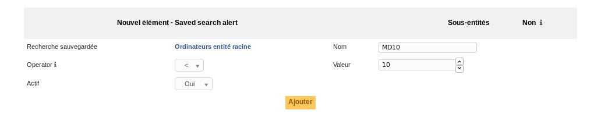

.. _bookmarks:

Recherches sauvegardées
=======================

GLPI offre un système de sauvegarde des recherches (marque pages). Une fois la recherche effectuée, il est possible de l'enregistrer depuis un bouton en forme d'étoile accessible dans le formulaire de recherche.

On distingue deux types de recherches :

* les recherches *privées* : utilisabes par tous les utilisateurs, elles ne sont accessibles que par leur auteur ;
* les recherches *publiques* : ne peuvent être créées que par les utilisateurs autorisés ; et sont accessibles par tous les utilisateurs sous réserve d'appartenir aux entités configurées.

Les recherches sauvegardéees sont accessibles en cliquant sur le bouton en forme d'étoile dans le menu utilisateur.

Depuis cette interface, il est possible de :

* réordonner les recherches privées (par glisser-déposer) - les recherches publiques utilisent un tri automatique ;
* sélectionner une recherche par défaut (une seule possible par type d'objet), en cliquant sur l'icône en forme d'étoile ;
* accéder aux résultats de la recherche (en cliquant simplement sur cette dernière) ;
* accéder à l'interface de gestion des recherches sauvegardées, en cliquant sur l'icône en forme de clé en haut à droite.

.. warning::

   Définir une recherche particulièrement lourde comme affichage par défaut peut avoir des effets catastrophiques sur les performances globales de l'application !

Affichage des compteurs
-----------------------

Le :ref:`paramétrage de GLPI <configuration>` permet de définir si les compteurs doivent être affichés ou non. Dans le cas des recherches, c'est un peu plus compliqué.

En effet, certaines recherches peuvent prendre beaucoup de temps (et de ressources) pour s'exécuter. Afin de limiter l'impact sur les performances, les requêtes les plus lourdes ne sont pas comptées par défaut. Pour que le temps d'exécution d'une requête sauvegardée puisse être calculé ; il faut qu'elle soit executée une fois au moins. Une tâche planifiée est également proposée pour calculer les temps d'exécution régulièrement (et ainsi éviter les requêtes qui seraient devenues lourdes au fil du temps).

Les administrateurs peuvent outrepasser la méthode de compte automatique, et faire en sorte qu'un recherche soit systématiquement comptée ou ne le soit jamais. Cette possibilité est à utiliser avec parcimonie.

Configuration d'alertes
-----------------------

Il est possible de configurer l'envoi « d'alertes » sur une recherche sauvegardées en utilisant le système de :ref:`notifications <notifications>` de GLPI. L'envoi d'une notification se base sur le nombre de résultats renvoyés par la recherche, comparé avec l'opérateur choisi à la valeur entrée.

La (ou les) notification utilisée est affichée pour référence depuis l'onglet de configuration des alertes. Pour les recherches privées ; seul l'utilisateur qui a créé la recherche peut être notifié, en utilisant un gabarit fournit par défaut ; dans ce cas de figure, une seule et unique notification sera liée.

Pour les recherches publiques, un évènement spécifique doit être créé, ainsi qu'une notification qui l'utilise. Ceci n'est possible que depuis l'onglet de configuration des alertes.

Une fois la notification spécifique créée ; il faudra bien entendu la configurer, en lui associant un gabarit, et en sélectionnant les destinataires souhaités. Notez qu'il est possible d'associer plusieurs notifications à une même recherche via l'évènement qui lui correspond.

.. note::

   Tant que la notification spécifique à une recherche publique ne sera pas créée ; il ne sera pas possible d'ajouter d'alertes.

   .. image:: images/saved_search_nonotif.png
      :alt: Sauvegarde des recherches publiques
      :align: center
