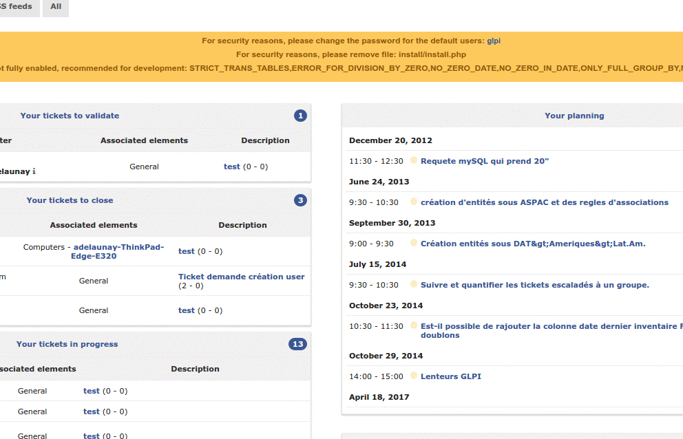

Naviguer dans les modules de GLPI
=================================

Les différentes fonctions de GLPI ont été regroupées en plusieurs modules, construits autour de contextes d'utilisation similaires.
La barre supérieure de l'interface permet de naviguer entre ces modules :

* Le :doc:`module Parc <../../modules/parc/index>` permet d'accéder aux différents matériels inventoriés,
* Le :doc:`module Assistance <../../modules/assistance/index>` permet de créer et de suivre tickets, problèmes et changements ; ainsi que voir les statistiques.
* Le :doc:`module Gestion <../../modules/gestion/index>` permet de gérer les contacts, fournisseurs, budgets, contrats et documents.
* Le :doc:`module Outils <../../modules/outils/index>` permet de gérer les projets, les notes, la base de connaissance, les réservations, les flux RSS et visualiser les rapports.
* Le :doc:`module Administration <../../modules/administration/index>` permet d'administrer les utilisateurs, groupes, entités, profils, règles et dictionnaires. Il permet aussi la maintenance de l'application (sauvegarde et restauration de base, vérifier si une nouvelle version est disponible) ainsi que la gestion de la file d'attente des courriels.
* Le :doc:`module Configuration <../../modules/configuration/index>` permet d'accéder aux options de configuration générale de GLPI : notifications, collecteurs, tâches automatiques, authentification, plugins, liens externes, SLA, gestion des intitulés, des composants ainsi que contrôle d'unicité des champs.

Les menus présentés varient en fonction des :ref:`habilitations de l'utilisateur connecté <administration-profils>`. Le contexte de navigation est présenté à l'utilisateur dans le fil d'ariane.

.. note::

   Vous trouverez en bas à droite un bouton vous permettant de revenir rapidement en haut de la page si besoin.

Il existe des raccourcis clavier qui permettent de naviguer d'un module/sous module à autre. Voici la liste de ces raccourcis :

* ``1`` => Accueil
* *Parc*

   * ``o`` => Ordinateurs
   * ``s`` => Logiciels

* *Assistance*

   * ``t`` => Tickets
   * ``a`` => Statistiques
   * ``p`` => Planning

* *Gestion*

   * ``d`` => Documents

* *Outils*

   * ``b`` => Base de connaissances
   * ``r`` => Réservations
   * ``e`` => Rapports

* *Administration*

   * ``u`` => Utilisateurs
   * ``g`` => Groupes

* *Configuration*

   * ``n`` => Intitulés

.. note::

   La combinaison de touches à associer à ces raccourcis est variable selon les systèmes d'exploitation et les navigateurs utilisés. Voici quelques exemples suivant les navigateurs :

   * Mozilla Firefox

      Appuyer simultanément sur les touches ``Alt``, ``Maj`` et *sur le raccourci voulu*.

   * Internet Explorer 7 et supérieur

      Appuyer simultanément sur les touches ``Alt``, ``Maj`` et *sur le raccourci voulu*, puis taper sur la touche ``Entrée`` pour valider la destination.

   * Opera

      Appuyer simultanément sur les touches ``Echap``, ``Maj`` et *sur le raccourci voulu*.

De plus, depuis la version 9.2, GLPI propose une navigation avec recherche approximative (fuzzy) accessible depuis le raccourci clavier ``Ctrl`` + ``Alt`` + ``G``.
Cela ouvrira une fenêtre modale vous permettant de filtrer, via un champ de recherche, tout les menus de GLPI (tout les niveaux sont présents, vous avez par exemple accès aux 3 ème niveaux tel que les intitulés ou les composants).

Dans cette fenêtre, des raccourcis supplémentaires sont disponibles:

* ``⇩`` et ``⇧`` afin de se déplacer dans les résultats
* ``Enter`` pour changer la page active de glpi sur le résultat sélectionné
* ``Esc`` (Echap) pour fermer la fenêtre de recherche.

