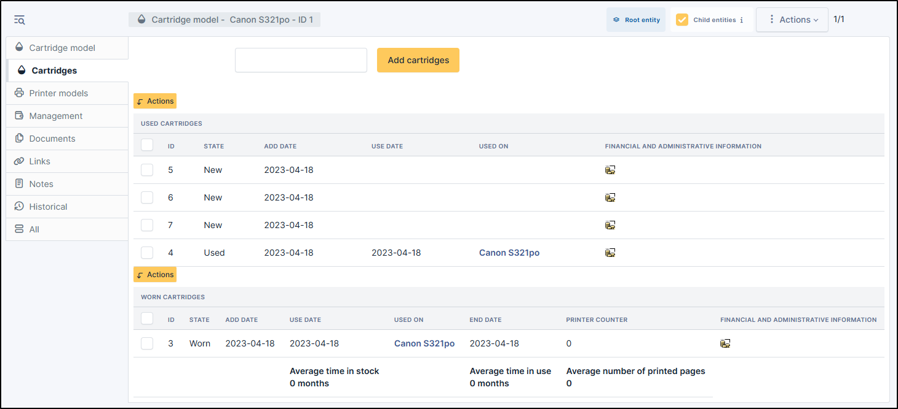
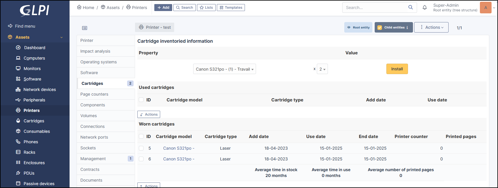
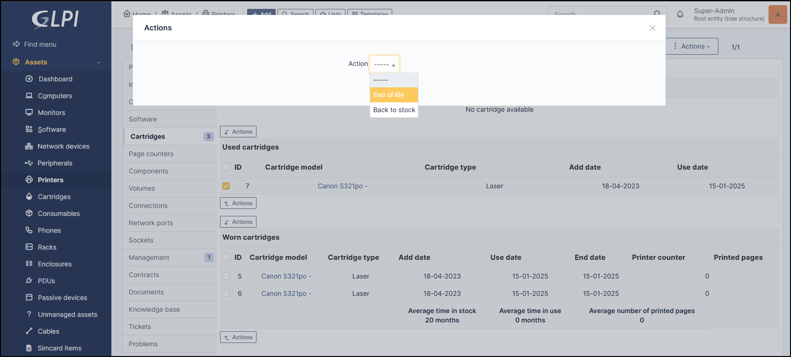
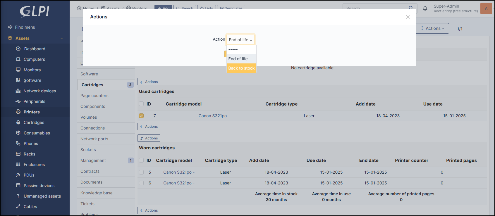

Cartridges
----------

The first table lists the cartridges that are new or in use. The second table lists the cartridges identified as end-of-life.

Add cartridges in new status
~~~~~~~~~~~~~~~~~~~~~~~~~~~~

* When cartridges is created, you can select numbers of item is needed
*  click on **Add cartridges**

.. note:: You can add one or more cartridges.

.. note:: The status of the cartridge by default is **new**

Change a cartridge in used status
~~~~~~~~~~~~~~~~~~~~~~~~~~~~~~~~~

* To change the status of a cartridge, go to **Assets** > **Printer** > *Select the printer* > **Cartridges**
* In **Property**, select the desired cartridge, the number and click **Install**

Change a cartridge in Worn
~~~~~~~~~~~~~~~~~~~~~~~~~~

* To change the status of a cartridge, go to **Assets** > **Printer** > *Select the printer* > **Cartridges**
* In **used cartridges** tab, select the appropriate cartridge
* use **Actions** button
* Then select **End of life**
* Click on **Post**

Change a cartridge to back to stock
~~~~~~~~~~~~~~~~~~~~~~~~~~~~~~~~~~~

* To change the status of a cartridge, go to **Assets** > **Printer** > *Select the printer* > **Cartridges**
* In **used cartridges** or **worm cartridges** tab, select the appropriate cartridge
* use **Actions** button
* Then select **Back to stock**
* Click on **Post**

