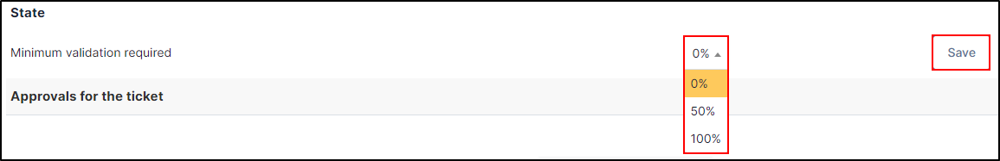

Approvals
---------

Approvals allow a ticket or a change to be validated (or not) by a third party or a group.

Add a request for approval
~~~~~~~~~~~~~~~~~~~~~~~~~~

* In your ticket or change, go to the approvals tab
* Start by defining the minimum validation required

You can choose between :

* **0%** - This **value is for information only**, because even if no one validates, it will not result in a global refusal of the request
* **50%** - If **half of the validators** approve the request, overall approval is **granted**.
* **100%** - **All validations** must be approved for the global status to be **granted**.

Send an approval request
~~~~~~~~~~~~~~~~~~~~~~~~

* Click on **Send an approval request**
* You can use **Template** to send an approval request
* In **approver** select the type of approver (user, group, group users(s))
* Select the **user** or **group** required
* Enter a **comment**
* You can add a **document** if it's necessary
* Click on **+ Add**

.. note:: you can't select several groups or users at once, you have to make separate approval requests for each group or user

.. Tip:: If you wish to add certain users to a group, select group user(s) and then select the desired users.

    .. image:: images/approvals-group-users.png
        :alt: add a new group for approval
        :scale: 63%

.. tip:: You can add a group if the required group does not exist. Click on **+** in **Approver**.
    Go to :doc:`Groups <../modules/administration/groups>` for more information

    .. image:: images/approvals-add-group.png
        :alt: add a new group for approval
        :scale: 63%

States
------

There are 3 different statuses:

- Waiting for approval
- Refused
- Granted

Approvals can also be viewed in a list at the same location

Users can change their approval status, whether previously granted or denied. This can be done directly from the ticket or change

.. collapse:: How to change state

    .. image:: images/approvals-change-state.gif
        :alt: Change your state
        :scale: 40%

It is also possible to delete an approval. Please note, however, that this does not change the final status, so you will need to resubmit one or more requests for approval to obtain a final result.

