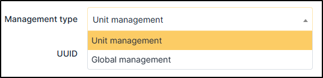

Management type
~~~~~~~~~~~~~~~

It is possible to manage peripherals either unitary or globally.

**Unitary** management corresponds to one peripheral per computer while **global** management make the peripheral a
virtual global element that will be connected to several computers.

Global management allows to limit the number of elements to manage when these elements are not a strategic data in the
assets management.

It is not natively possible to add a management type.

