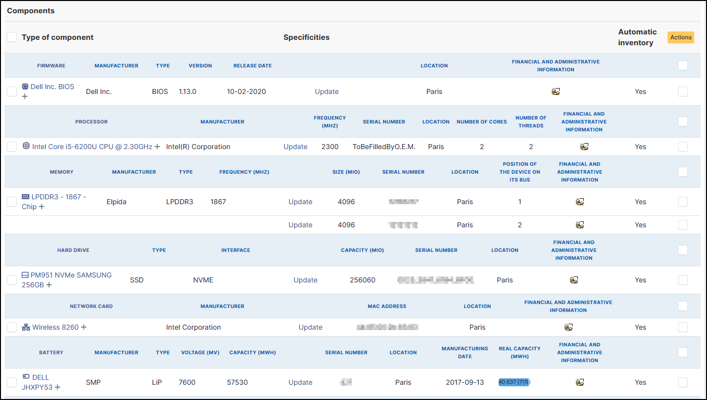

Components
----------

.. Note:: You can add any component by clicking on **Add a new component** at the top of the screen.
   The component you want to add must already exist. If it is not in the list, you can add new ones in
   `setup > components </modules/configuration/components.html>`_.

   .. image:: images/component-add.png
      :alt: component add
      :align: center
      :scale: 55%

Firmware
~~~~~~~~

The firmware references :

* Firmware
* Manufacturer
* Type
* Version
* Release Date
* Location
* Financial and administrative informative (if activated in setup > General > assets tab)
* Automatic inventory

Processor
~~~~~~~~~

The firmware references :

* Processor
* Manufacturer
* Frequency
* Serial number
* Location
* Number of cores
* Number of threads
* Financial and administrative informative (if activated in setup > General > assets tab)
* Automatic inventory

Memory
~~~~~~

* Memory
* Manufacturer
* Type
* Frequency
* size
* Serial number
* Location
* Position of the device on its bus
* Financial and administrative informative (if activated in setup > General > assets tab)
* Automatic inventory

Hard Drive
~~~~~~~~~~

* Hardrive
* Type
* Interface
* Capacity (MIO)
* Serial number
* Location
* Financial and administrative informative (if activated in setup > General > assets tab)
* Automatic inventory

Network card
~~~~~~~~~~~~

* Network
* Manufacturer
* MAC Address
* Location
* Financial and administrative informative (if activated in setup > General > assets tab)
* Automatic inventory

Battery
~~~~~~~

* Battery
* Manufacturer
* Type
* Voltage (MV)
* Capacity (MWH)
* Serial number
* Location
* Financial and administrative informative (if activated in setup > General > assets tab)
* Automatic inventory

Graphics card
~~~~~~~~~~~~~

* Graphical card
* Chipset
* Memory (MIO)
* Location
* Manufacturer date
* Real capacity (MWH)
* Financial and administrative informative (if activated in setup > General > assets tab)
* Automatic inventory

Soundcard
~~~~~~~~~

* Soundcard
* Manufacturer
* Location
* Financial and administrative informative (if activated in setup > General > assets tab)
* Automatic inventory

Controller
~~~~~~~~~~

* Controller
* Manufacturer
* Interface
* Location
* Financial and administrative informative (if activated in setup > General > assets tab)
* Automatic inventory