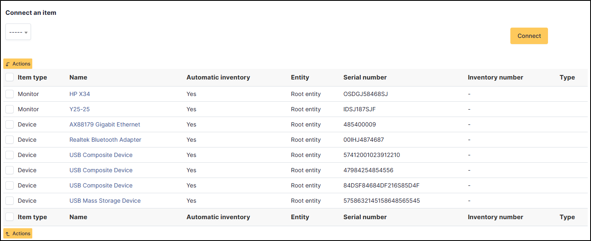
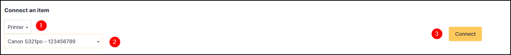

Connections
-----------

This field lists all the devices that have either been detected by the automatic inventory or added manually.

The materials reassembled are :

* Device
* Monitor
* Phone
* Printers

Add a connection
~~~~~~~~~~~~~~~~

- You can add a connection by selecting the **type of the device**
- Select the **materiel**
- Click on **Connect**

If you need to add new equipment that is not on the list, you must add it directly to the asset concerned

* `Device <devices.html>`_
* `Monitor <monitors.html>`_
* `Phone  <phones.html>`_
* `Printers <printers.html>`_

Delete a connection
~~~~~~~~~~~~~~~~~~~

The deletion of a connection can be made from the entry of each connected hardware via mass actions (select the **check box** and
click on **Actions** buttom)

.. note::
   Every deletion or addition of a connection is recorded in the history of the computer.