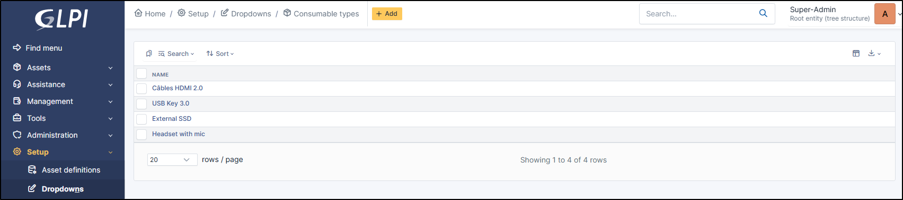
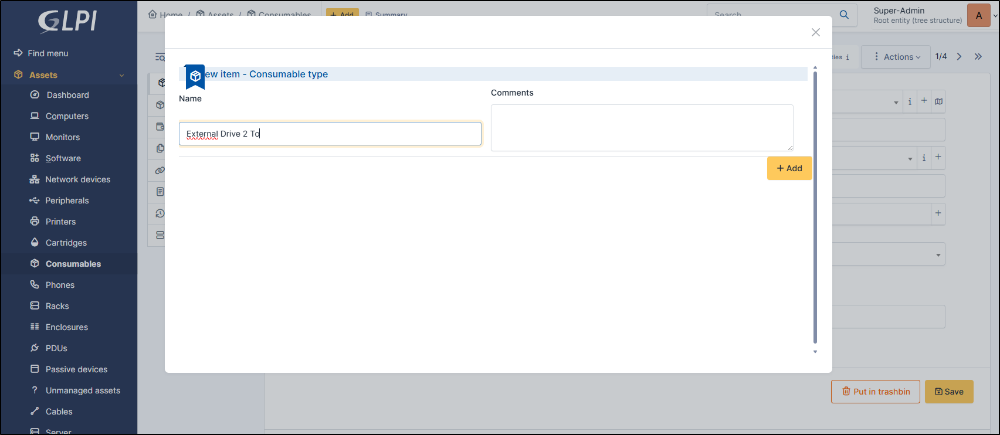
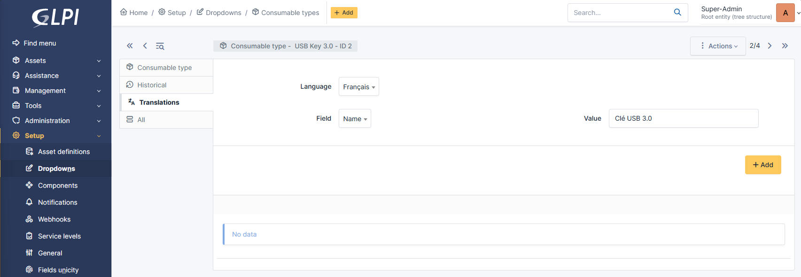

Consumable type
---------------

Consumable type defines a category of consumable.

Add a consumable type
~~~~~~~~~~~~~~~~~~~~~

* To Add a consumable type, click on **+**
* Add a **name** and a **comment** (optionnal)
* Clic on **+ Add**
* Select the type on the dropdown list

Delete a consumable type
~~~~~~~~~~~~~~~~~~~~~~~~

* Click on **i** (show consumables types) or go to  **Setup > Dropdowns > Consumable types**
* Select the items you want to Delete
* Use **Actions** button to delete your item(s). You can also enter in the item and click on **Delete permanently**

Translate consumable type
~~~~~~~~~~~~~~~~~~~~~~~~~

* Consumable type can be translated in **Setup > Dropdowns > Consumable types**
* Select the item required
* Go to **Translations**
* Click on **Add a new Translation**
* Select the langage
* Select the field to translate
* Enter the value
* Click on **+ Add**

