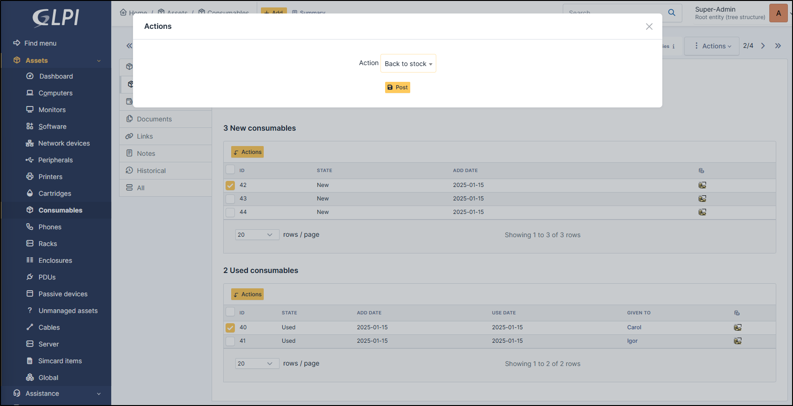

Consumables
-----------

The first table lists the consumables that are new. The second table lists the consumables identified as used.

Add consumable in new status
~~~~~~~~~~~~~~~~~~~~~~~~~~~~

* When consumable is created, you can select numbers of item is needed
*  click on **Add consumables**

.. note:: You can add one or more consumable.

.. note:: The status of the consumable by default is **new**

Change a consumable in used status
~~~~~~~~~~~~~~~~~~~~~~~~~~~~~~~~~~

* To change the status of a consumable, select it by the check box
* Click on **Actions** button
* Select **Give**
* Select groups or users
* Select the entry you want

.. note:: when the consumable is used, you can change the owner of this item by repeating the operation below

Change a consumable to back to stock
~~~~~~~~~~~~~~~~~~~~~~~~~~~~~~~~~~~~

* To change the status of a consumable, select it by the check box
* Click on **Actions** button
* Select **Back to stock**
* Click on **Post**

Delete a consumable
~~~~~~~~~~~~~~~~~~~

* To delete a consumable, select it by the check box
* Click on **Actions** button
* Select **Delete permanently**
* Click on **Post**

.. note:: You can delete a consumable whether it is **new** or **used**