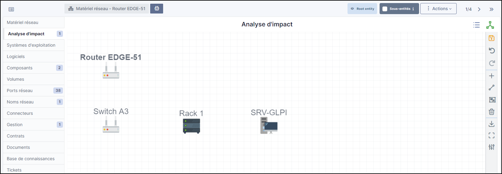
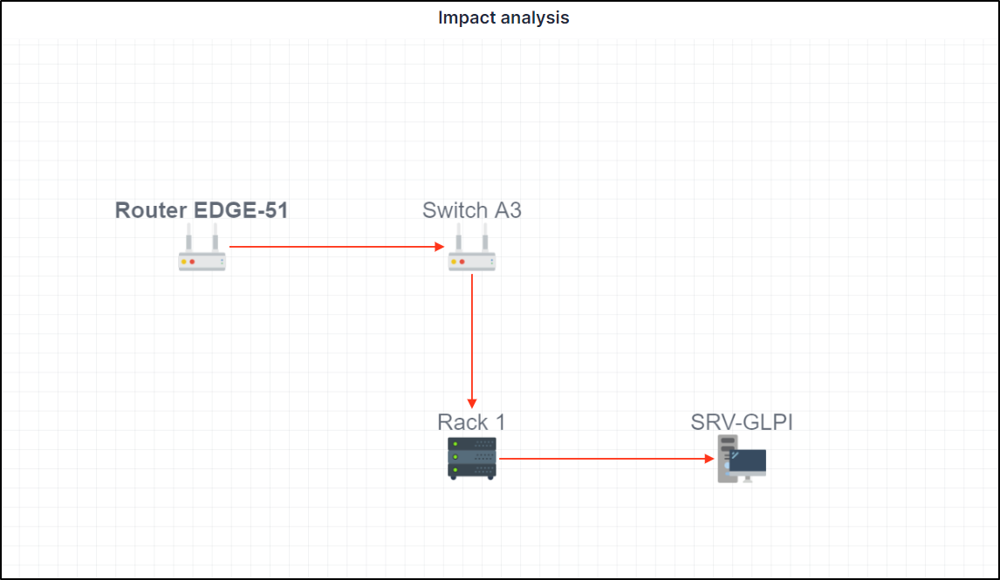
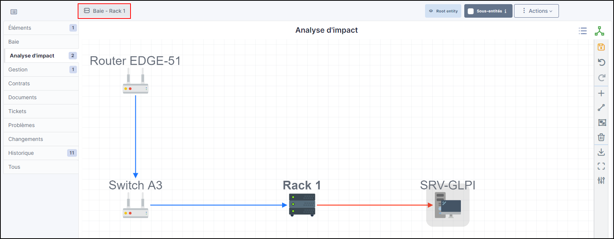
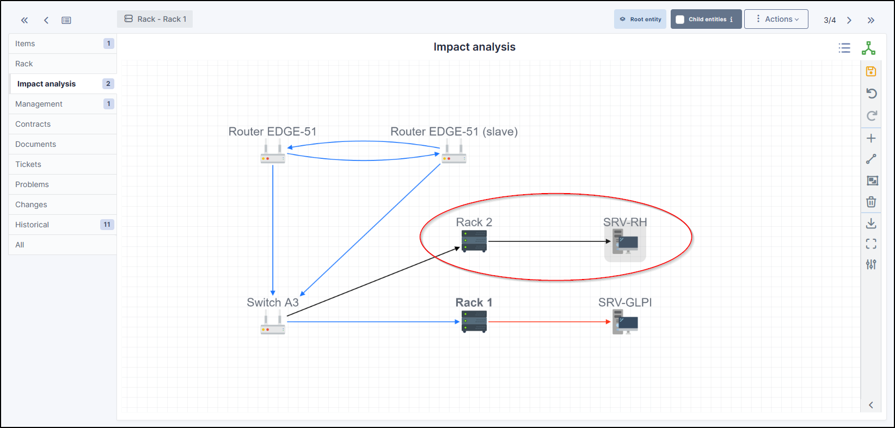
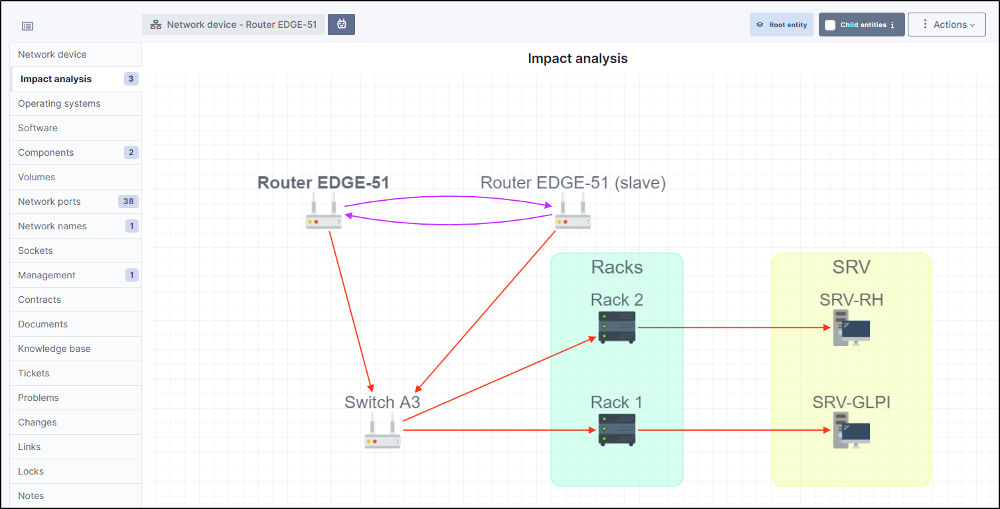
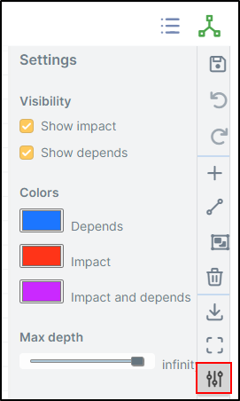

Impact Analysis
---------------

Impact analysis enables an infrastructure diagram to be drawn up, showing the dependencies and impacts in the event of equipment loss.
This can be saved and exported

.. Note:: We'll take a simple example. A router is connected to a switch to which a rack containing a server is attached.

   .. image:: ../../image/analysis_impact-1.png
      :alt: module assets - example analysis imapct
      :align: center
      :scale: 60%

Notions
~~~~~~~

2 concepts need to be understood:

- **Impact**: represented by default by a red arrow. If this element encounters a problem, it will impact all linked elements.
- **Dependency**: represented by default by a blue arrow. A dependency is an element which will be directly affected by the impact. A dependency does not necessarily affect the elements linked to it.

.. Note:: An important element to understand is that you need to place yourself in the context of the element in question. If you select a switch, the impacts and dependencies will be different if you select an element linked to the switch.

Create an impact analysis
~~~~~~~~~~~~~~~~~~~~~~~~~

Your equipment must be powered up before you can use the impact analysis.

If we go back to our example given above, we'll start from the 1st item, i.e. the router.

- Go to **Assets > Network devices**
- Select the network hardware you require
- In the **impact analysis** tab, the hardware you are on will appear
- On the right-hand bar, click on **+**
- The list of categories appears, choose the one that suits you (here network hardware to link our switch to our router)
- Drag and drop the hardware you want.
- Do the same with all the hardware you want

You'll get a result like this (depending on how you've placed your items)

Adding links
~~~~~~~~~~~~

Now that our materials have been placed, we need to add the links in order to check their impact and dependencies (or both).

- From the right-hand menu, click on the icon **diagonal line**
- Your mouse will then appear with a **+**
- Hold your mouse over the 1st element, and release the mouse over the element to be linked.
- Repeat the operation for all the desired elements

Explanation of links
~~~~~~~~~~~~~~~~~~~~

As mentioned above, you need to understand the context of the selected element. What we see in the diagram above is that all the links are in red. This means that if the router were to fail, all the following elements would be affected.

If we position ourselves on **Rack 1**, the behaviour will not be the same:

In this example, **from the point of view of Rack 1**, the only hardware that would impact the infrastructure if it were to fail is **SRV-GLPI**.
**Rack 1** depends on **Router EDGE-51** and **Switch A3**. They are in blue (dependency) because they would not be impacted if Rack 1 were to experience a problem.

Dependency and impact on the same hardware
~~~~~~~~~~~~~~~~~~~~~~~~~~~~~~~~~~~~~~~~~~

We can add a router to our example, which will be linked to the 1st original router:

.. image:: ../../image/analysis_impact-4.png
   :alt: module assets - dependency/imapct
   :align: center
   :scale: 72%

- To do this, create a relationship in one direction and then in the other using the **diagonal line** option seen above.

The purple arrows mean that they are dependent on each other and that they would both be affected if one of them were to encounter a problem. They are therefore both dependent and impacted.

No impact
~~~~~~~~~

There is one last type of link, those that have no dependency or impact:

The black arrows mean that from the element you are on, there will be no imapct if that element were to fail. In our example, we are on **Rack 1**. This does not communicate with **Rack 2**, so there will be no dependency or impact in the event of a failure.

Groups
~~~~~~

Groups can be created using the :fontawesome-regular-object-group: icon in the right-hand menu.

Groups allow you to see all the elements that depend on another piece of equipment. You can create a name for the group and choose a background colour.

To delete a group, right-click on it and select delete. This only deletes the group, not the items it contains.

Save your imapct analysis
~~~~~~~~~~~~~~~~~~~~~~~~~

Remember to save your project with the **floppy** icon

Deleting elements
~~~~~~~~~~~~~~~~~

You can delete an element using **trashbin** icon. This deletes the element and the link.

Download your project
~~~~~~~~~~~~~~~~~~~~~

You can download your impact analysis using the **downloading** icon. The download format is PNG.

Enlarge your analysis
~~~~~~~~~~~~~~~~~~~~~

Use the **maximize** icon to make your analysis full screen.

You can also use your mouse wheel to zoom in and out.

Link configuration
~~~~~~~~~~~~~~~~~~

You can configure certain options using the **adjustments** icon:

Visibility
~~~~~~~~~~

In visibility, you can choose to show only impacts and/or dependencies.

Colours
~~~~~~~

In the colours tab, you can change the colours of dependencies, impacts and impacts and dependencies.

Maximum depth
~~~~~~~~~~~~~

The maximum depth is the number of elements that can be displayed on your imapct analysis. If you select "infinity", there will be no display limit.