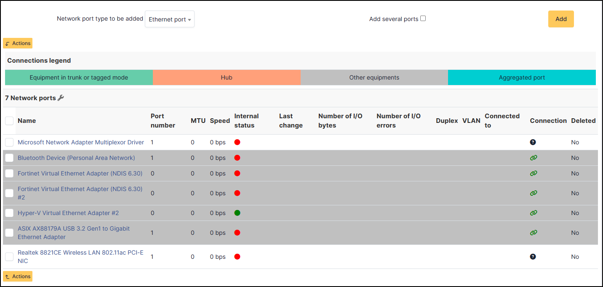
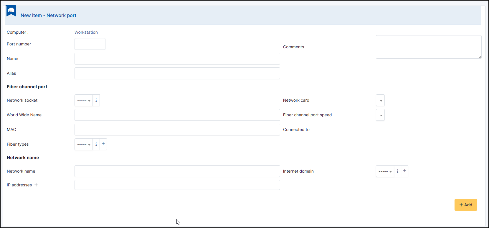
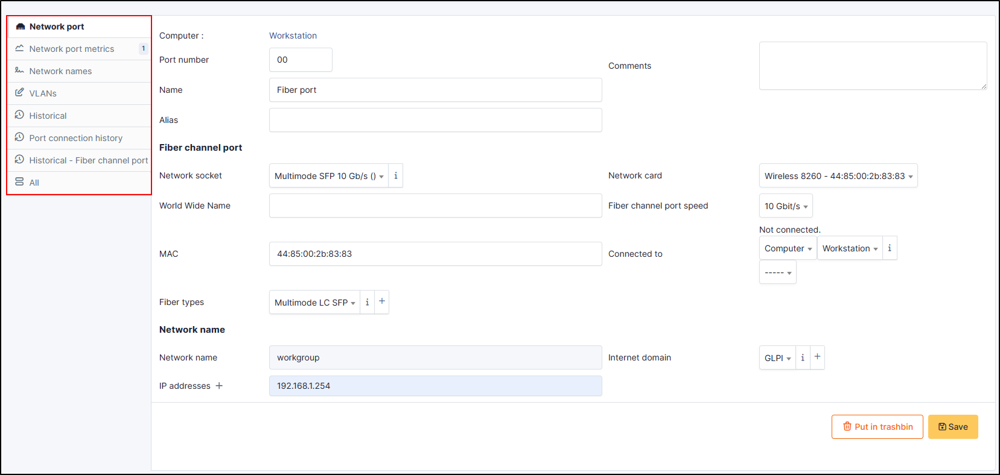
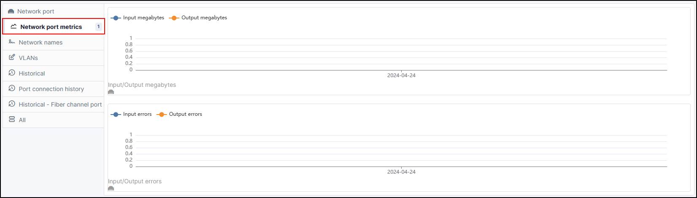
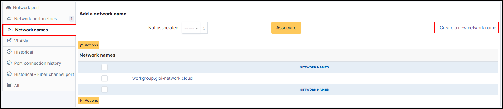
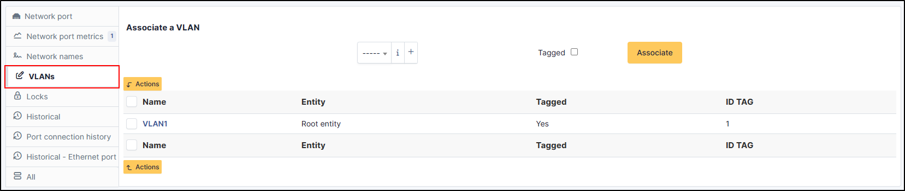
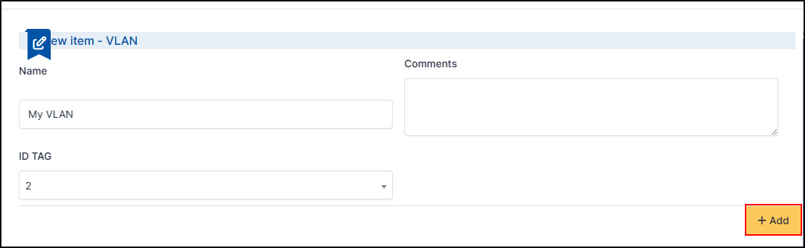
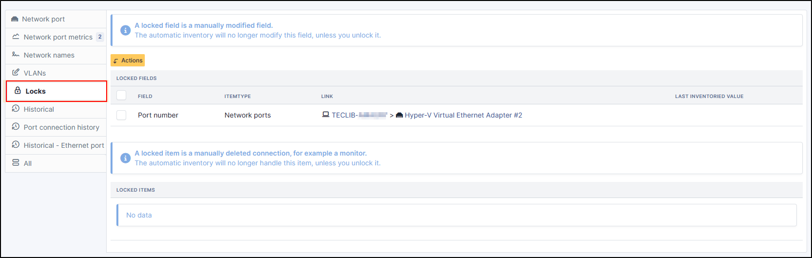
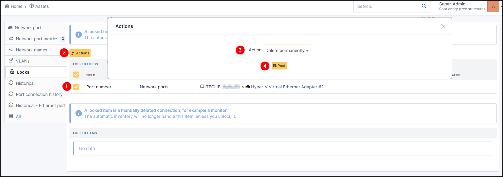
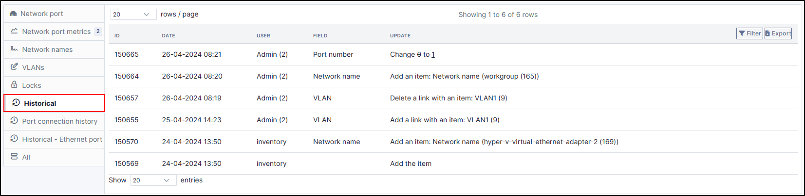

Network ports
=============

This tab, named **Network ports** allows to manage the network ports attached to a computer.
They can be brought up by the automatic inventory or added manually

A network port represents the output of a network interface on a given hardware. A port is characterized by a number and a name.
The information that can be viewed is:

* Name
* Port number
* MTU
* Speed
* Internal status
* Last change
* Number of I/O bytes
* Number of I/O erros
* Duplex
* VLAN
* Connected to
* Connection
* Deleted

This information can be uploaded via the automatic inventory. It can also be added/modified manually.

Network ports can be of different types:

* physical port: ethernet, WiFi...
* :term:`Virtual network port`: local loop-back, alias, aggregates...
* point to point: switched network...

The `Network port` tab groups in a table the ports that are available
on the equipment. The table header contains the total number of ports
and a link that allows to choose display options. This allows to
selectively display or mask information such as network data (IP...),
port characteristics depending on its type, MAC address, VLANs...

.. note::

   GLPI allows to present complex network connection with for example WiFi or Ethernet port aliases associated to VLANs grouped in aggregates...

Management of Ethernet network ports
------------------------------------

The Ethernet protocol is classically used on internal networks.

An Ethernet port is characterized by its type (twisted pair,
mono-mode/multi-mode optical fiber...), a transfer rate ((10Mb, 100Mb,
1Gb, 10Gb...) and a MAC address. It is possible to associate to the
port a network card and a network plug.

Ethernet connections are realized by linking two Ethernet ports, which
requires that there is a free port on each equipment to be
connected. In general, a connection links a port attached to a
computer, a peripheral or a printer and a port attached to a network
equipment (hub, switch).

Management of WiFi network ports
--------------------------------

The WiFi protocol is widely used on wireless networks.

A WiFi port is characterized by the mode of the network card (ad-hoc,
access point, repeater...), the WiFi protocol version (ab, g...) and
its MAX address.

It is possible to associate a network card to the port, similarly to Ethernet ports.

A WiFi network can be associated to a given port. Apart from its name, a WiFi network has an ESSID and is characterized by its type:

*Infrastructure:* WiFi network with on or several access points and connected clients
*Ad-hoc:* WiFi network between similar systems without access points

Management of local loop-back ports
-----------------------------------

The local loop-back is a virtual port used by most equipments for internal communication. It is this port that is used when connecting to ``localhost`` or ``127.0.0.1``.

Local loop-back has no specific attribute.

Management of network port aliases
----------------------------------

A network port alias is a virtual port that can refine a physical port.

On Linux, to each VLAN, when transmitted `"tagged" <glossary/tagged_vlan.html>`_, is associated a port alias, for example `eth2.50` to represent VLAN 50 on port `eth2`.

A port alias contains its base port and a MAC address.

Note that when the origin port is changed, the MAC address of the new port is affected to the port alias.

Management of network port aggregates
-------------------------------------

A network port aggregate is a virtual port that allows to group several physical ports.

On Linux, aggregates are represented by bridges linking together different ports. In the same way, an Ethernet firewall uses a bridge that links interfaces to be filtered.

A port aggregate contains the origin ports and a MAC address.

Add a port
-------------

You can add several types of port :

* Ethernet port
* Wifi port
* Aggregation port
* Alias port
* Connection by dial line - Dialup Port
* Local loop port
* Fiber channel port

To add a port, select the one you want and click on **Add**

You will be asked to provide a certain amount of information. Once you have filled in the details, click on **+ Add**

Additional configuration of new port
~~~~~~~~~~~~~~~~~~~~~~~~~~~~~~~~~~~~

Once added, you can view/modify/add a certain amount of information from the various fields that have just been added.

Metrics
~~~~~~~

In the **Metrics** tab, you can see the machine's network consumption

Network Name
~~~~~~~~~~~~

You can associate a  via this tab or create a new one by clicking on create a new network name.
Go to :doc:`Network Name <../../modules/configuration/dropdowns/network-name>` for more details.

.. note::
   When a network port has only one network name, this name is displayed
   in the network port form itself and it is possible to modify the
   name directly. It is also possible to modify the network name via
   its own form, accessible by clicking on the link under the name.

   When a network port has several network names, the only way to
   modify the network names is via the network name form.

Associate a VLAN
~~~~~~~~~~~~~~~~

It is possible on a network port to add one or more VLAN, these VLANs being defined by a name, an optional comment and a VLAN number.
Tags are avaialble for VLAN.

Create a VLAN
^^^^^^^^^^^^^

- If you want to create a VLAN, click on **+**
- Fill in the necessary fields
- Click on **+ Add**

You can select your new VLAN in the dropdown list.

Locks
~~~~~

A locked field is a manually modified field. The automatic inventory will no longer modify this field, unless you unlock it.
You can manually deleted a connection, for example a monitor. The automatic inventory will no longer handle this item, unless you unlock it.

- To unlock a field, click on **check box**
- Then **Actions**
- Select **Delete permanently**
- And **Post**

Historical
~~~~~~~~~~

This field references all the changes that have been made to the network port, whether manually or via the automatic inventory

