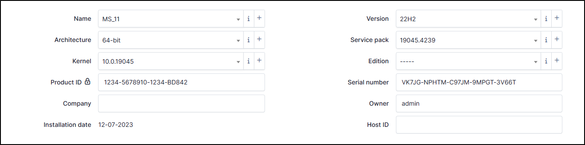

Operating Systems
-----------------

Name
~~~~

This information is updated by the automatic inventory. You can add/modify it manually if necessary.

* To create a name, click **+**
* Enter the **Name**
* Enter a comment (optionnal)
* Click **+ Add** to save your OS
* You can, now, select your OS in the drop-down list

=========== =======================================================================================
OS            CLI
=========== =======================================================================================
Windows      ``Get-CimInstance -ClassName Win32_OperatingSystem | Select-Object -Property Caption``
Linux        ``cat /etc/issue``
MAC          ``MacOSX is hard-coded in the GLPI agent code``
=========== =======================================================================================

Architecture
~~~~~~~~~~~~

Identifies the architecture of the referenced machine (32 or 64 bits, ARM, etc.).
This information can be provided automatically via the automatic inventory or can be added manually.

* To create an architecture, click **+**
* Enter the **Name**
* Enter a comment (optionnal)
* Click **+ Add** to save your architecture
* You can, now, select your OS in the drop-down list

=========== ===============================================================================================
OS            CLI
=========== ===============================================================================================
Windows       ``Get-CimInstance -ClassName Win32_OperatingSystem | Select-Object -Property OSArchitecture``
Linux         ``uname -m``
MAC           ``uname -m``
=========== ===============================================================================================

Kernel
~~~~~~

It is the version of the kernel. This information can be updated by the automatic inventory or can be added manually.

* To create a Kernel, click **+**
* Enter the **Name** (the version)
* Enter a comment (optionnal)
* In Kernel field, select the one that suits you best.

  * If none match, click on the **i**
  * Click **+ Add**
  * Enter the name you want
  * Click **+ Add**
  * Go back to **computer > operting systems** and repeat the previous step to create your kernel

* Click **+ Add** to save your architecture
* You can, now, select it in the drop-down list

=========== =========================================================================================
OS            CLI
=========== =========================================================================================
Windows       ``Get-CimInstance -ClassName Win32_OperatingSystem | Select-Object -Property Version``
Linux         ``uname -r``
MAC           ``uname -r``
=========== =========================================================================================

Product ID
~~~~~~~~~~

References the OS serial number. This information can be accessed via :

=========== =========================================================================================
OS            CLI
=========== =========================================================================================
Windows     ``Get-CimInstance -ClassName Win32_OperatingSystem | Select-Object -Property SerialNumber``
Linux       ``/etc/sysconfig/rhn/systemid``
MAC         No information
=========== =========================================================================================

Company
~~~~~~~

If a company has been registered, this field refers to it. This information can be provided automatically via the automatic inventory or can be added manually.

=========== ===============================================================================================
OS            CLI
=========== ===============================================================================================
Windows      ``Get-CimInstance -ClassName Win32_OperatingSystem | Select-Object -Property organization``
Linux        No information
MAC          No information
=========== ===============================================================================================

Version
~~~~~~~

This field references the OS version (22.04.4 LTS Jammy Jellyfish, 22H2, etc.). This field can be updated by the automatic inventory.
You can create a version if you want to customize this field :

* To create a version, click on **+**
* Enter a **Name**
* Enter a **Comment** (optionnal)
* Click **+ Add**
* Select now the version you want by the drop-down list

Service pack
~~~~~~~~~~~~

Service pack is the OS package installed on the machine (generally for Windows).
This information can be provided automatically via the automatic inventory or can be added manually.

* To create a service pack, click **+**
* Enter a **Name**
* Enter a **Comment** (optionnal)
* Click **+ Add**
* Select now the service pack you want by the drop-down list

Edition
~~~~~~~

This field was previously used to indicate the edition of the OS, but is now indicated in the name field.

This information can be provided automatically via the automatic inventory or can be added manually.

* To create an Edition, click **+**
* Enter a **Name**
* Enter a **Comment** (optionnal)
* Click **+ Add**
* Select now the edition you want by the drop-down list

Serial number
~~~~~~~~~~~~~

Generally for Windows, this field references the `Client Product Key <https://learn.microsoft.com/en-us/windows-server/get-started/kms-client-activation-keys>`_ installed on the machine.
This is not the licence of the OS but genric key the Operating system edition (Windows Pro 11, Windows Server 2022 Datacenter, etc.)
This information is updated by the automatic inventory but you can add/modify this value manually.

Owner
~~~~~

The field is the owner of the licence. This information can be updated by the automatic inventory or can be added manually.

=========== ===============================================================================================
OS            CLI
=========== ===============================================================================================
Windows      ``Get-CimInstance -ClassName Win32_OperatingSystem | Select-Object -Property registereduser``
Linux        No information
MAC          No information
=========== ===============================================================================================

Host ID
~~~~~~~

Typically for Linux, HostID allows administrators to associate it with software licences or perform system-specific operations.
This information is updated by the automatic inventory but you can add it manually.
You can find this information with ``hostid`` command on Linux System.
