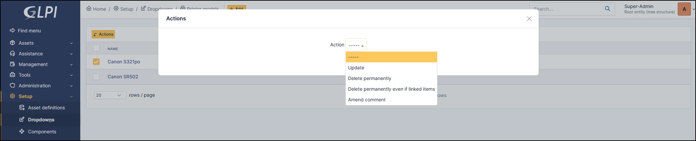

Printer models
--------------

To make management easier, you can share cartridges between several compatible printers.

In the dropdown list, select the printer(s) that you wish to make compatible with the cartridge.

Add a new model
~~~~~~~~~~~~~~~~

* You can add new printer model by clicking on **+**
* Add a name, product number, comments and pictures if necessary

.. image:: images/cartridges_add_printer_models.png
   :alt: Printer models - add model
   :align: center
   :scale: 41%

.. note:: you can list the printer models in **Setup > Dropdowns > Printer models**

Delete a printer model
~~~~~~~~~~~~~~~~~~~~~~

* To delete a printer model go to **Setup > Dropdowns > Printer models**
* Use massive action to **delete** a model

