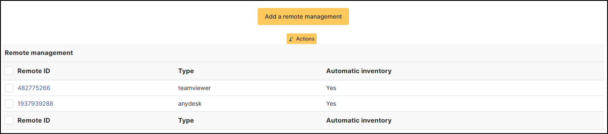
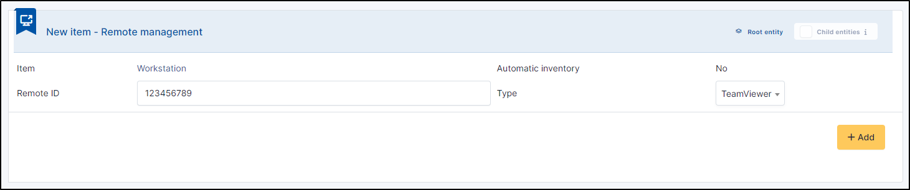

Remote Management
=================

Remote mamagement is used to reference the remote access software installed on the workstation, such as Teamviewer, Anydesk, etc.
It is possible to add software manually if required, but the information can be fed back via the automatic inventory.

If you click on the connection ID, you will be redirected to the remote management provider's page.
The applications detected are :

* Teamviewer
* Litemanager
* Anydesk
* Meshcentral
* Supremo
* Rustdesk
* RMS
* TacticalRMM

Add a new remote access
-----------------------

- To add a remote access manually, click on **Add a remote mannagement**
- Enter the ID number (which can be found on the user's PC or on a management console if your tool has one)
- Select the tool from the list
- Click on  **+ Add**

Delete a remote access
-----------------------

You can use the massive action to delete a remote access

- Click the **check box**
- Click on **Actions**
- Select **Delete permanently**

