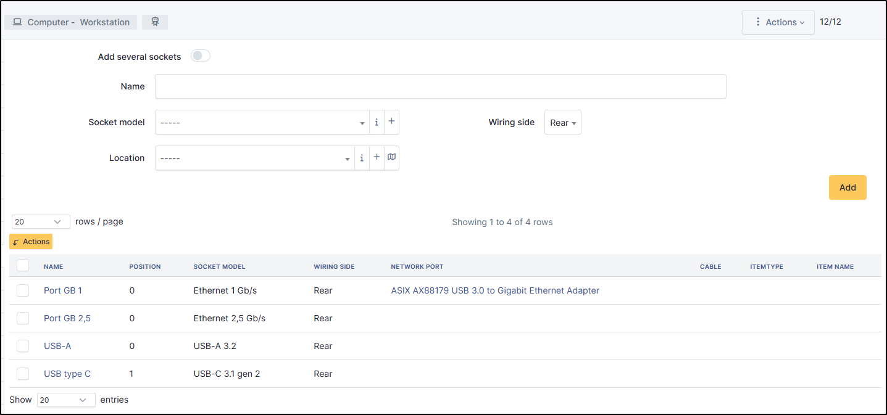
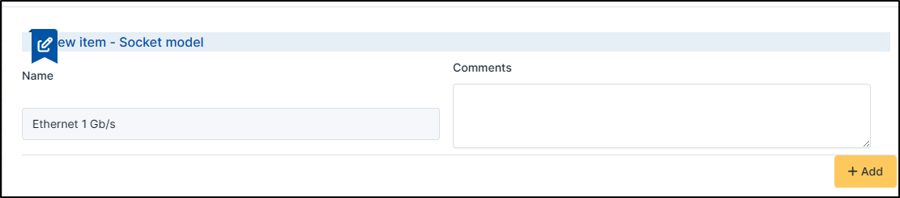
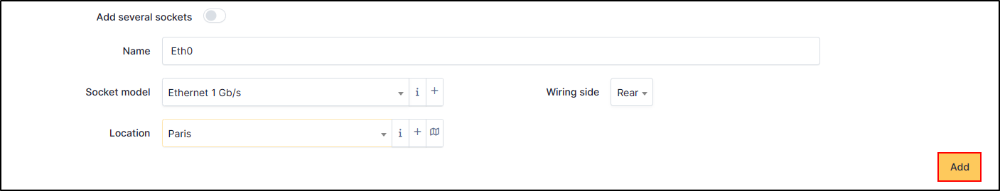
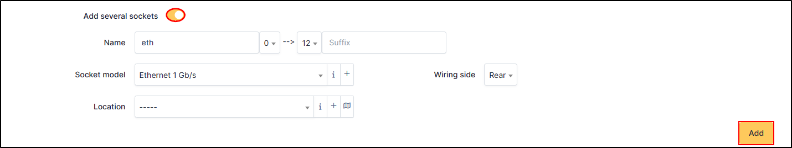
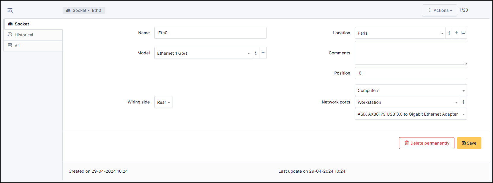

Sockets
=======

Sockets are the list of physical sockets present on the hardware. These sockets can be Ethernet, USB, HDMI, etc.
This information cannot be returned by the automatic inventory, so you have to add it manually.

It enables hardware to be linked by cables. Socket is also linked to the :doc:`cables <../modules/assets/cables>` object

You can add them either en masse or one by one.

Add a socket
------------

* To add a socket, enter a name,
* Select the socket model. You can add them by clicking on **+**.

* Select the `location <../common_fields.html#location>`_
* Define the **wiring side** (rear or front)
* Click on **Add** to save your socket

* To add several sockets, repeat the above actions but tick the Add several sockets box. You can add a prefix or suffix to help you 
  to indentify the sockets

Advanced Setup
~~~~~~~~~~~~~~

When the socket is valideted, you can setup the advanced options.

* Add a position if needed
* when you add a socket via the machine directly, it will be preselected, otherwise select the desired hardware type
* Select the machine you require
* Then, select the hardware on which the socket is present (generally a network card)

.. tip:: In the case of a bulk addition, you will need to select each socket and add the information to it

.. note:: To connect this computer to an other equipment, go to :doc:`cables <../modules/assets/cables>`