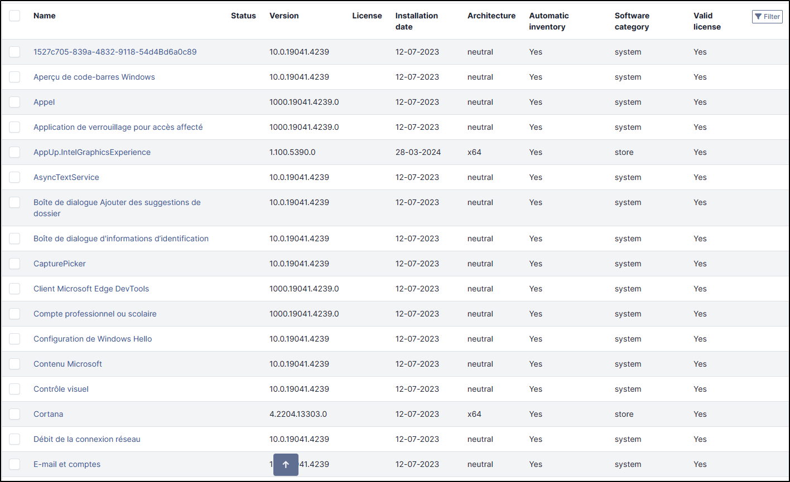
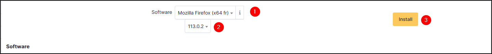

Software
--------

This field displays the list of applications installed on a machine (computer, network equipment, etc.).

Install a Software
~~~~~~~~~~~~~~~~~~

You can install new software from the list of existing applications

- In **software** field, select the desired application,
- Select the **version**
- click on **install**

Delete a software
~~~~~~~~~~~~~~~~~

You can delete one or more softwares, you can select the check box, and click on **Actions** and select **Delete permanently**.

If you make a mistake, you can always go back to the previous step to add it again

.. Note::
   If you need to add or modify a softawre  (not already presents in the list),  you need to go to the `Assets > Software </modules/assets/softwares.html>`_ tab.