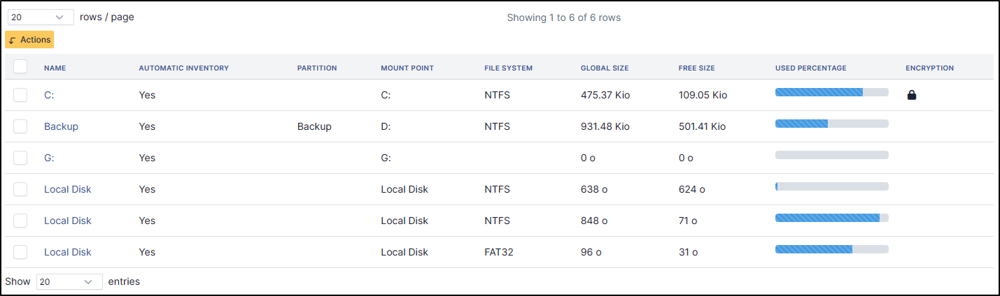
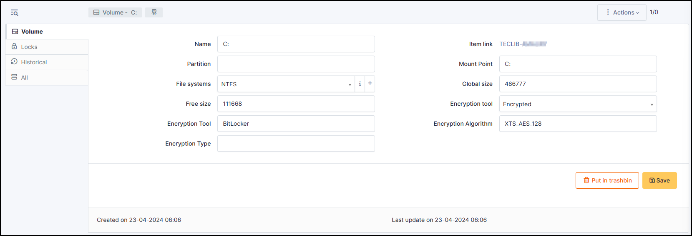

Volumes
-------

Each partition has its own information that can be consulted

Volumes are added by the automatic inventory, but can also be added manually.

Add a volume
~~~~~~~~~~~~~

You can delete one or more softwares, you can select the check box, and click on **Actions** and select **Delete permanently**.

* To add a new volume, click on **Add a volume**
* Fill in the necessary fields
* If your file systems is not present, you can a new one by clicking on **+**

  * Fill the fields and save your new file systems

Delete a volume
~~~~~~~~~~~~~~~~~

You can delete one or more volume, you can select the check box, and click on **Actions** and select **Delete permanently**.