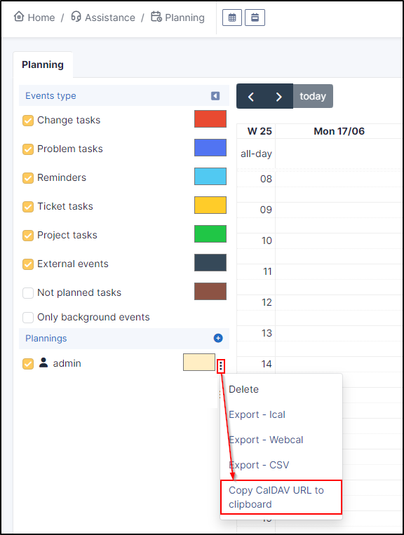

# :ti-adjustments: Configuration générale

#### :ti-help-circle-filled:{style="color: grey; font-size: 23px;" .middle} Comment obtenir des informatins sur la documentation des API ?

Afin d'obtenir de l'aide sur les API, vous pouvez consulter la documentation directement depuis votre instance. Pour cela, dans :ti-settings:**`configuration`** > :ti-adjustments:**`générale`** > **`API`** changer l'option à **`Oui`** sur **`activer API Rest`**. L'option **`documentation en ligne de l'API`** appraitra. Si vous rencontrez un message d'erreur lorsque vous cliquez sur la documentation, cliquez sur **`full access from localhost`** et supprimer les IP (ou indiquer l'IP du poste sur lequel vous vous trouvez) dans les champs début et fin de plage d'adresse IPv4.

#### :ti-help-circle-filled:{style="color: grey; font-size: 23px;" .middle} Une politique de mot de passe est elle présente ?

Oui, pour les comptes internes uniquements. Les comptes externes (LDAP, SSO, etc.) étant depéndants d'un serveur dédié, cette politique ne peut pas s'appliquer à ces comptes.

Il est possible de demander à ce que le mot de passe :

* requiert au moins un chiffre,
* requiert au moins une minuscule,
* requiert au moins un symbole,
* ait une longueur minimum (longueur paramétrable),
* expire après un délai (délai paramétrable),
*   soit désactivé si le mot de passe n'a pas été modifié depuis un certain délai (délai paramétrable),

    Il est également possible de demander à ce qu'une notification de délai d'expiration soit envoyée aux utilisateurs.

#### :ti-help-circle-filled:{style="color: grey; font-size: 23px;" .middle} Comment désactiver la réinitialisation de mot de passe par mail ?

Afin de désactiver la réinitialisation de mot de passe par mail, il faut désactiver la notification **`Password forget`** (:ti-settings:**`Configuration`** > :ti-bell:**`Notifications`** > :ti-bell:**`Notifications`**)

#### :ti-help-circle-filled:{style="color: grey; font-size: 23px;" .middle} Peut on augmenter le délai de réinitialisation de mot de passe qui est d'un jour ?

Lorque vous demandez une réinitialisation de mot de passe depuis GLPI, vous avez 24 heures pour effectuer cette réinitialisation. Ce délai n'est pas modifiable, si les 24 heures sont dépassées, une nouvelle demande doit être faite.

#### :ti-help-circle-filled:{style="color: grey; font-size: 23px;" .middle} Comment mettre GLPI en mode maintenance ?

Si vous avez des opérations à réaliser qui nécessitent de mettre GLPI en mode maintenance, il est possible de le faire de 2 façons :

* En **CLI** (on premise uniquement) : dans le dossier glpi exécutez **`php bin/console maintenance:enable`** (ou **`php bin/console maintenance:disable`** pour le désactiver)
* En **WebUI** : dans le menu :ti-settings:**`configuration`** > :ti-adjustments:**`générale`** onglet **`système`**

!!! Tip "Astuce" Pour outrepasser le mode maintenance, vous pouvez accéder à GLPI en ajoutant **`?skipMaintenance=1`** (_https://moninstance.com/index.php?skipMaintenance=1_)

#### :ti-help-circle-filled:{style="color: grey; font-size: 23px;" .middle} Comment purger l'historique de GLPI ?

Afin de ne pas surcharger la base de GLPI, il est possible de purger l'historique de certains items :

* général,
* logiciels,
* informations financières et administratives,
* utilisateurs,
* composants,
* toutes les sections (purger toute les entrées de l'historique)

Par défaut, l'option **`conserver tout`** est sélectionnée. Il est possible de ne conserver l'historique entre 1 et 120 mois soit par section soit pour l'ensemble.

!!! Info On entend par historique l'onglet **`historique`** d'un objet GLPI.

#### :ti-help-circle-filled:{style="color: grey; font-size: 23px;" .middle} A quoi servent les verrous ?

Les verrous permettent d'interdire la modification de certaines informations.

!!! Example "Exemple" Vous ne souhaitez pas que le champ utilisateur soit modifié lors de la remontée d'inventaire automatique.

Il faut alors activer les verrous dans :ti-settings:**`configuration`** > :ti-adjustments:**`générale`** > **`configuration générale`**. Sélectionnez activer les verrous et sélectionnez le **`profil à utiliser pour verrouiller les objets`** ainsi que les **`types d'objet à verrouiller`**. Pour verrouiller un champ, il suffit de le modifier manuellement. Seul le profil paramétré sera en mesure de verrouiller et déverrouiller les champs. Pour les deverouiller, rendez-vous dans le champ **`verrou`** de l'item en question.

Un cadenas {style="width: 40%" .middle} appraitra lorsqu'une information est verrouillée.

#### :ti-help-circle-filled:{style="color: grey; font-size: 23px;" .middle} Est il possible de paramétrer des jours ouvrables sur le support ?

Oui, dans :ti-settings:**`configuration`** > :ti-adjustments:**`générale`** onglet :ti-headset:**`assistance`** vous pouvez paramétrer des jours ouvrables dans le champ **`planification des journées ouvrées`**

#### :ti-help-circle-filled:{style="color: grey; font-size: 23px;" .middle} Comment changer de thème GLPI ?

Le changement de thème peut se faire de plusieurs façons :

* _**Pour une utilisation individuelle**_ : rendez-vous les :ti-adjustments-alt:**`préférences`** utilisateurs (en haut à droite) puis dans l'onglet **`personnalisation`** vous pouvez choisir la **`palette de couleur`** qui vous convient.
* _**Pour une configuration globale**_ : rendez-vous dans :ti-settings:**`configuration`** > :ti-adjustments:**`générale`** > **`valeurs par défaut`**. Vous pouvez choisir la palette de couleur qui vous convient et sera appliqué à tous les utilisateurs.

Vous avez également la possibilité de modifier le CSS par entité. Rendez-vous dans :ti-shield:**`administration`** > :ti-stack:**`entité`**, sélectionnez l'entité désirée, puis **`personnalisation de l'interface`**. Indiquez **`Oui`** dans le champ **`activer la personnalisation CSS`** et coller votre code CSS dans la zone dédiée.

#### :ti-help-circle-filled:{style="color: grey; font-size: 23px;" .middle} Comment affecter une langue par défaut pour tous les utilisateurs ?

Pour modifier la langue par défaut, rendez-vous dans :ti-settings:**`configuration`** > :ti-adjustments:**`générale`** > **`valeurs par défaut`**. Un champ **`langue par défaut`** est disponible dans la section **`personnalisation`**. Ce changement est valable pour tous les utilisateurs.

!!! Info Les utilisateurs pourront malgré tout changer de langue s'ils le souhaitent depuis leur profil.

#### :ti-help-circle-filled:{style="color: grey; font-size: 23px;" .middle} Comment récupérer l'UUID de mon instance ?

Valable pour les instances on-premise uniquement :

Dans :ti-settings: **`configuration`** > :ti-adjustments: **`Générale`** cliquez sur **`voir ce qui sera envoyé`**. C'est la 1ère valeur qui apparaitra :

```{
"glpi": {
"uuid": "hQ6ZuLpydjmaTuUCqnaqE6tTdsksio84sdfV8Kb1",
"version": "10.0.10",
   }
```

#### :ti-help-circle-filled:{style="color: grey; font-size: 23px;" .middle} Comment augmenter le nombre de résultat de recherche par page ?

Dans :ti-settings:**`configuration`** > :ti-adjustments:**`générale`** > **`configuration générale`**, ajustez le **`Nombre maximum de résultats de recherche (par page)`** selon votre choix.

#### :ti-help-circle-filled:{style="color: grey; font-size: 23px;" .middle} Comment peut on désactiver la recherche globale ?

Dans :ti-settings:**`configuration`** > :ti-adjustments:**`générale`** > **`configuration générale`**, mettre **`non`** à **`recherche globale`**.

#### :ti-help-circle-filled:{style="color: grey; font-size: 23px;" .middle} Peut on activer/désactiver la possibilité de **`"se souvenir de moi"`** ?

Dans :ti-settings:**`configuration`** > :ti-adjustments:**`générale`** > **`configuration générale`**, en bas de l'écran, cliquez sur désactiver ou indiquez en jours la rétention de l'identifiant possible.

#### :ti-help-circle-filled:{style="color: grey; font-size: 23px;" .middle} Peut-on configurer des heures/jours d'ouverture ?

Depuis :ti-settings:**`configuration`** > :ti-edit:**`intitulés`**, entrez **`calendrier`** et cliquez sur :ti-calendar:**`calendriers`**, vous pourrez ajouter des jours et heures d'ouveture pour chacune de vos entités. Une procédure est disponible{:target="\_blank"} pour vous accompagner à les paramétrer.

#### :ti-help-circle-filled:{style="color: grey; font-size: 23px;" .middle} Peut-on configurer des jours de fermeture ?

Il est possible de configurer des jours de fermetures (type jours fériés) depuis :ti-settings:**`configuration`** > :ti-edit:**`intitulés`**, entrez **`fermeture`** et cliquez sur :ti-calendar-x:**`périodes de fermeture`** Une procédure est disponible{:target="\_blank"} pour vous accompagner à les paramétrer.

#### :ti-help-circle-filled:{style="color: grey; font-size: 23px;" .middle} Peut on synchroniser un calendrier avec GLPI ?

GLPI intègre un serveur CalDAV, ce qui permet le partage d'un calendrier de GLPI vers l'extérieur. Il est également possible de le modifier depuis les 2 endroits. C'est natif via le lien que j'ai indiqué précédemment.

* Pour cela, rendez-vous dans :ti-headset:**`Assistance`** > :ti-calendar-time:**`Planning`**
* Cliquez sur :ti-dots-vertical:
* Cliquez ensuite sur "**`Copier l'URL CalDAV dans le presse-papiers`**"
* Collez ce lien dans votre outil de messagerie

{style="width: 40%"}

La copie d'un lien d'une messagerie externe vers GLPI (type calendrier Outlook), ce n'est pas natif. Il faut passer par un outil tiers (hors du périmètre de Teclib) comme https://caldavsynchronizer.org.

#### :ti-help-circle-filled:{style="color: grey; font-size: 23px;" .middle} Comment éviter l'import de doublon dans GLPI ?

Si vous souhaitez éviter que 2 item portent le même numéro de série, que 2 utilisateurs aeint le même identifiant, l'**`unicité de champs`** vous aidera à éviter ces doublons. Afin de le configurer, vous pouvez suivre cette procédure{:target="\_blank"}.
